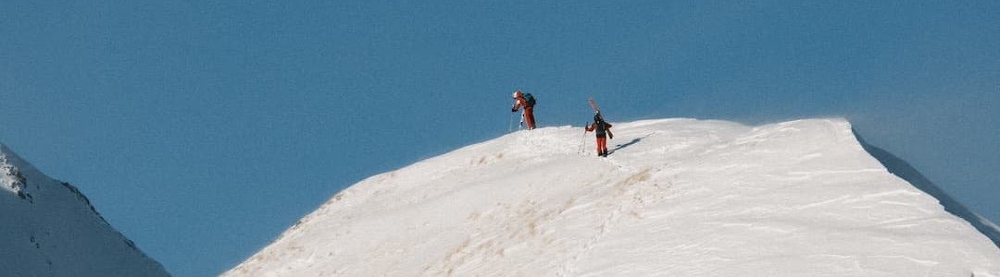
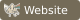

  

<h3 align="center">Hi I am Lucas</h3>

  Currently working full-time @
  
  and also finishing up my MSc. Computer Science @ ITU 

  
  
  
  
  

  Have earlier created <a href="https://github.com/itu-campuscup/judge-it">Judge IT</a> and <a href="https://github.com/itu-campuscup/show-it">Show IT</a>.
  Two webapps used for <a href="https://campuscup.dk">CampusCup</a>.

<h3> Code preferences</h3>

  <table align="center">
    <tr>
      <th> Tolerates</th>
      <th> Loves</th>
    </tr>
    <tr>
      <td>Significant whitespace</td>
      <td>Curly braces</td>
    </tr>
    <tr>
      <td>Somehow host your webapp</td>
      <td>Creating the webapp</td>
    </tr>
    <tr>
      <td>Refactoring old code</td>
      <td>Writing a new feature from scratch</td>
    </tr>
    <tr>
      <td>Fixing merge conflicts</td>
      <td>Solving algorithmic challenges</td>
    </tr>
    <tr>
      <td>Debugging in the morning</td>
      <td>Drinking coffee in the morning</td>
    </tr>
    <tr>
      <td>Finding a license manually</td>
      <td>Using <a href="https://github.com/lucasfth/repolicense-cli" target="_blank" rel="noopener noreferrer">repolicense CLI</a> to find the license</td>
    </tr>
  </table>

<!-- https://github.com/inttter/md-badges -->

<h3 align="center"> Latest YouTube videos</h2>

  <!-- BEGIN YOUTUBE-CARDS -->

<!-- END YOUTUBE-CARDS -->

<h3 align="center"> Latest Blog Posts</h3>

  <!-- BLOG-POST-LIST:START --><li><a href="https://lucashanson.dk/blog/self-hosted-ai-agents">(2026 Sep) I made my phone the brain of my AI agents - How I run a personal AI assistant on an old Android phone: one shared markdown vault, one self-hosted model, four agents, and the problems Android causes.</a></li>
<li><a href="https://lucashanson.dk/blog/downsize-images">(2025 Mar) Downsizing Images - Downsizing images to prevent unauthorized use.</a></li>
<li><a href="https://lucashanson.dk/blog/first-post">(2025 Feb) My first blog post - A brief introduction to my blog.</a></li>
<!-- BLOG-POST-LIST:END -->

